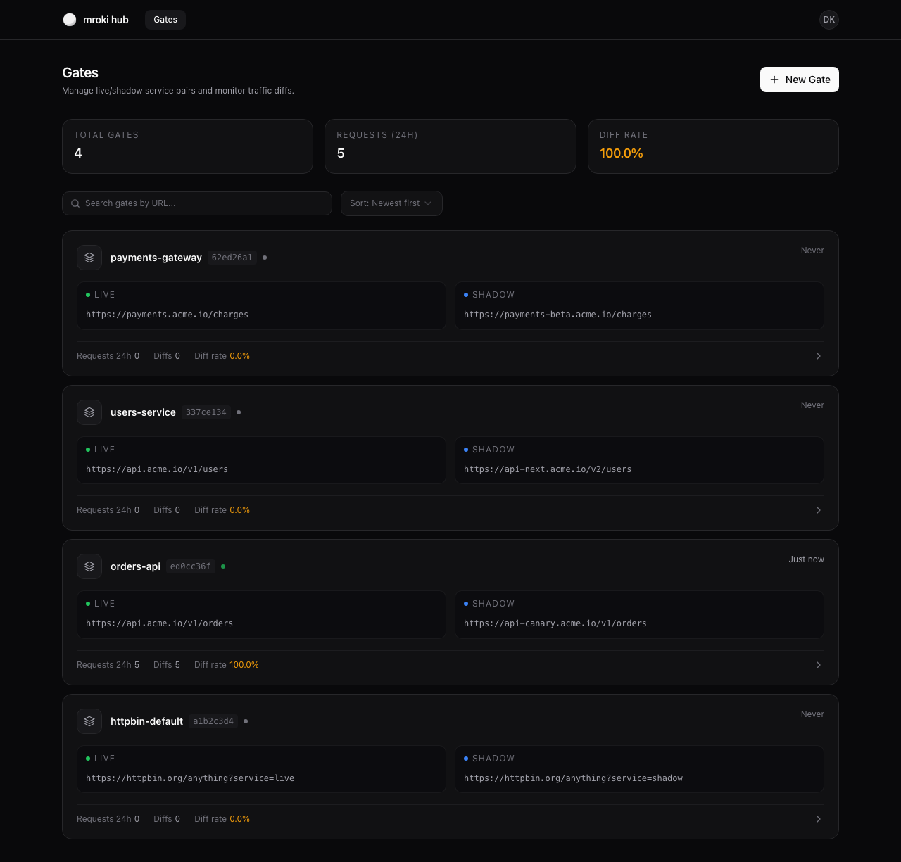
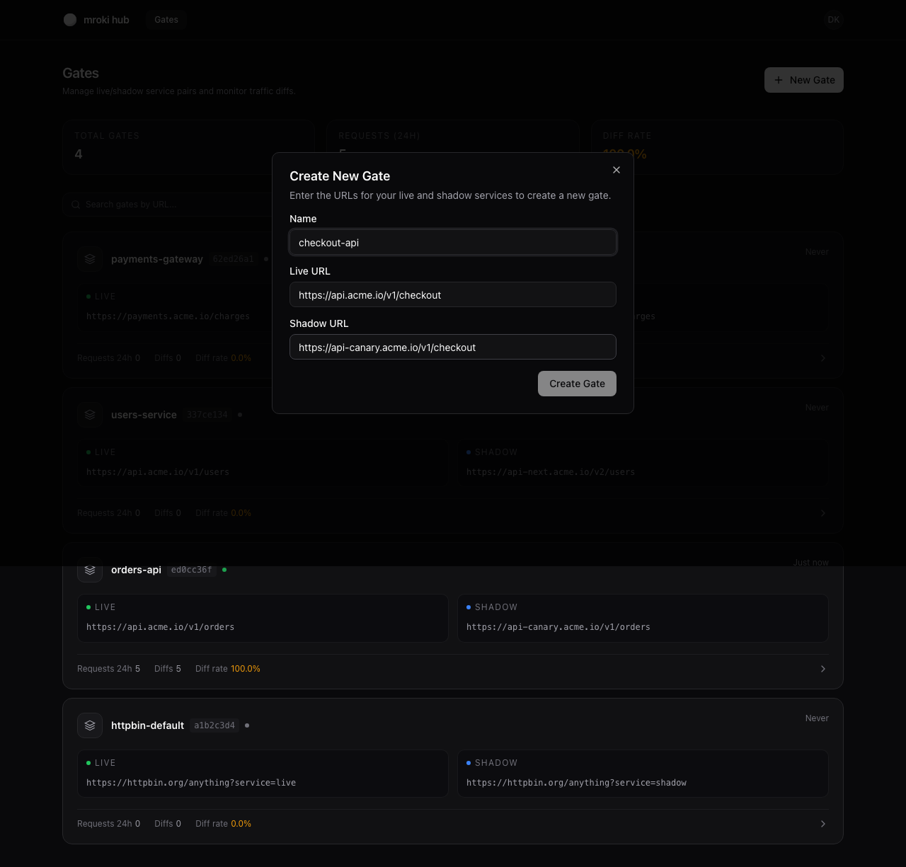
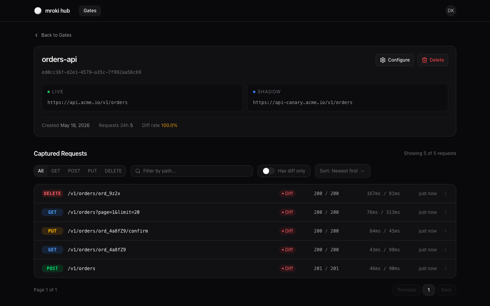
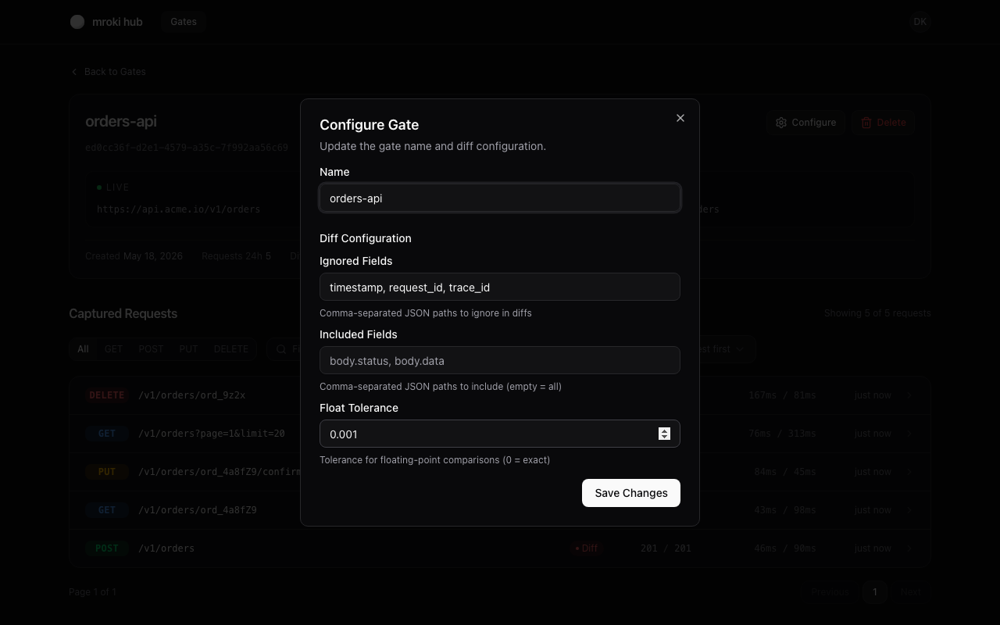
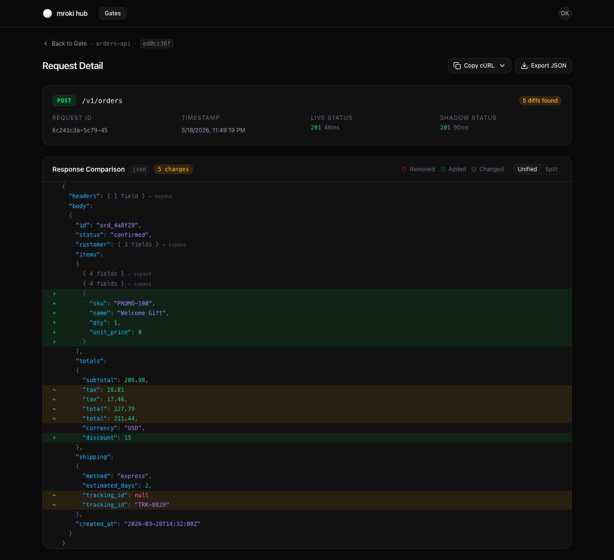
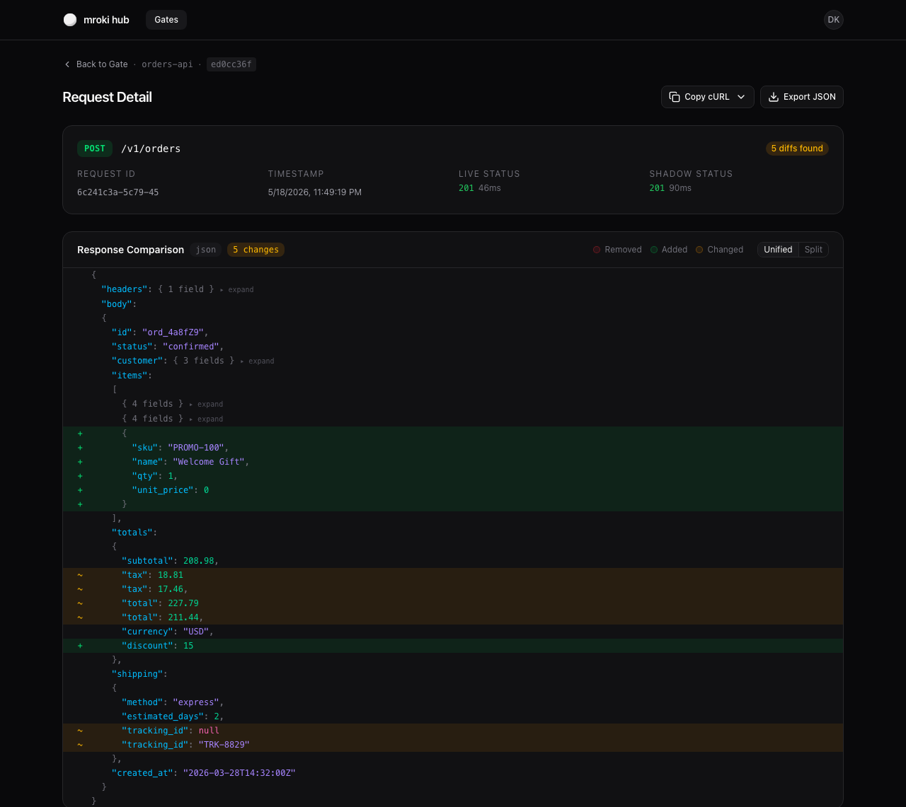

# Screenshots

A visual tour of the mroki Hub interface.

## Gates

Manage your live/shadow service pairs. Each gate card shows the live and shadow URLs, request volume, diff rate, and proxy status.

## Create Gate

Create a new gate by entering a name and the live/shadow service URLs. The dialog validates inputs before submission.

## Gate Detail

Browse captured requests for a gate. Filter by HTTP method or path, and see at a glance which requests produced diffs.

## Gate Configuration

Configure diff behavior per gate — set ignored fields (JSON paths excluded from diffs), included fields (restrict diffs to specific paths), and float tolerance for numeric comparisons.

## Request Detail — Unified Diff

Visualize JSON response diffs with syntax-highlighted tokens. Unchanged subtrees are collapsed by default — click any collapsed node to expand it inline.

## Request Detail — Split Diff

Side-by-side comparison of live and shadow responses with matched rows.

