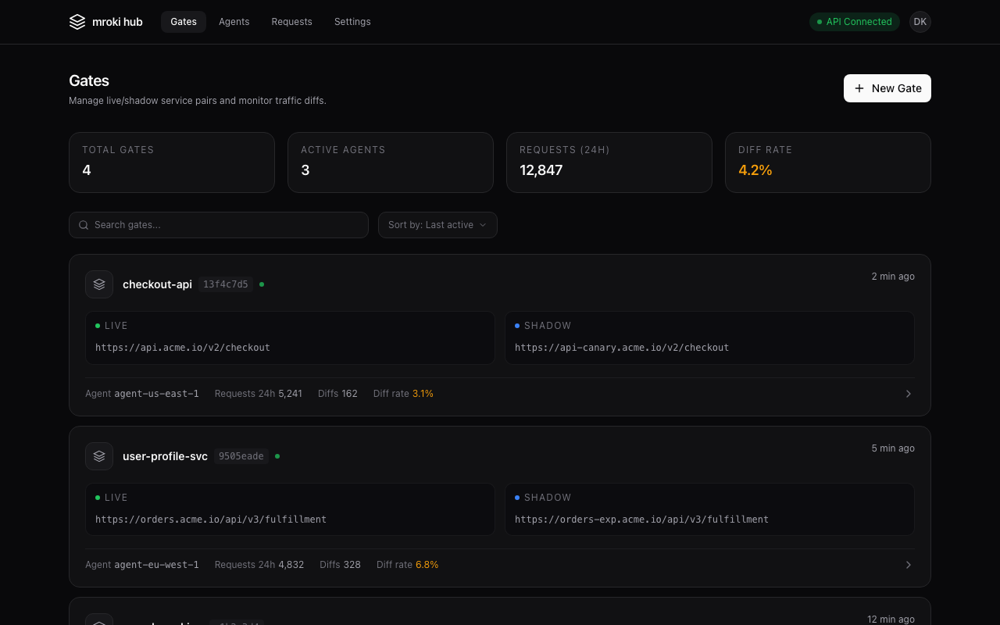
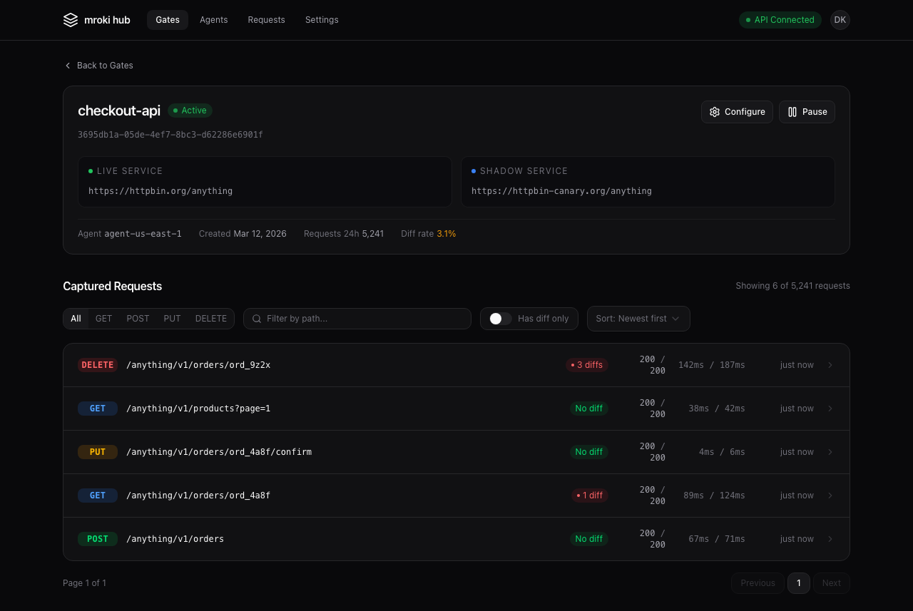
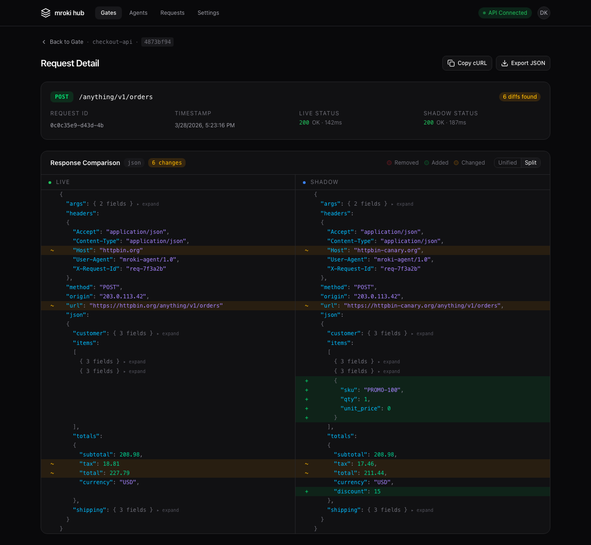

# Screenshots

A visual tour of the mroki Hub interface.

## Gates

Manage your live/shadow service pairs. Each gate card shows the live and shadow URLs, request volume, diff rate, and agent status.

## Gate Detail

Browse captured requests for a gate. Filter by HTTP method or path, and see at a glance which requests produced diffs.

## Request Detail — Unified Diff

Visualize JSON response diffs with syntax-highlighted tokens. Unchanged subtrees are collapsed by default — click any collapsed node to expand it inline.

## Request Detail — Split Diff

Side-by-side comparison of live and shadow responses with matched rows.

