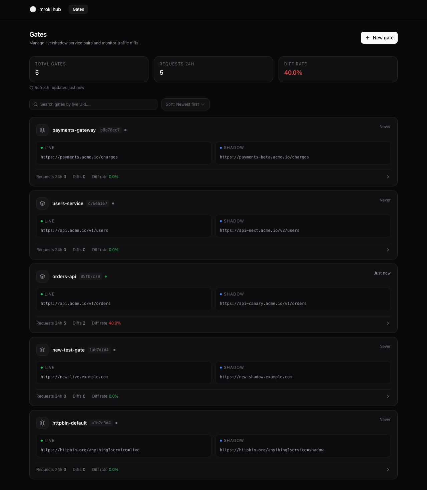
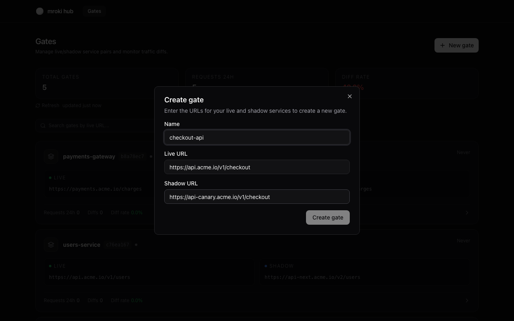
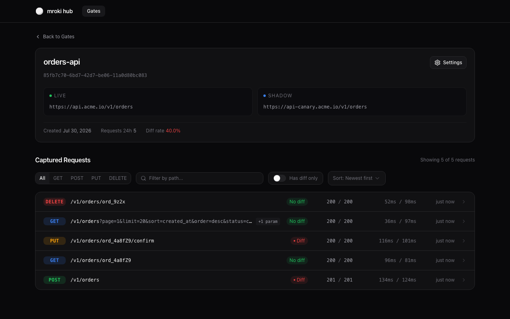
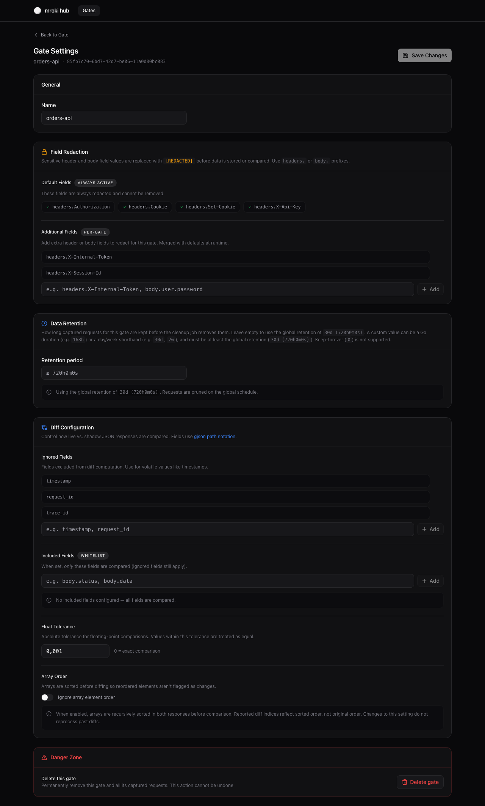
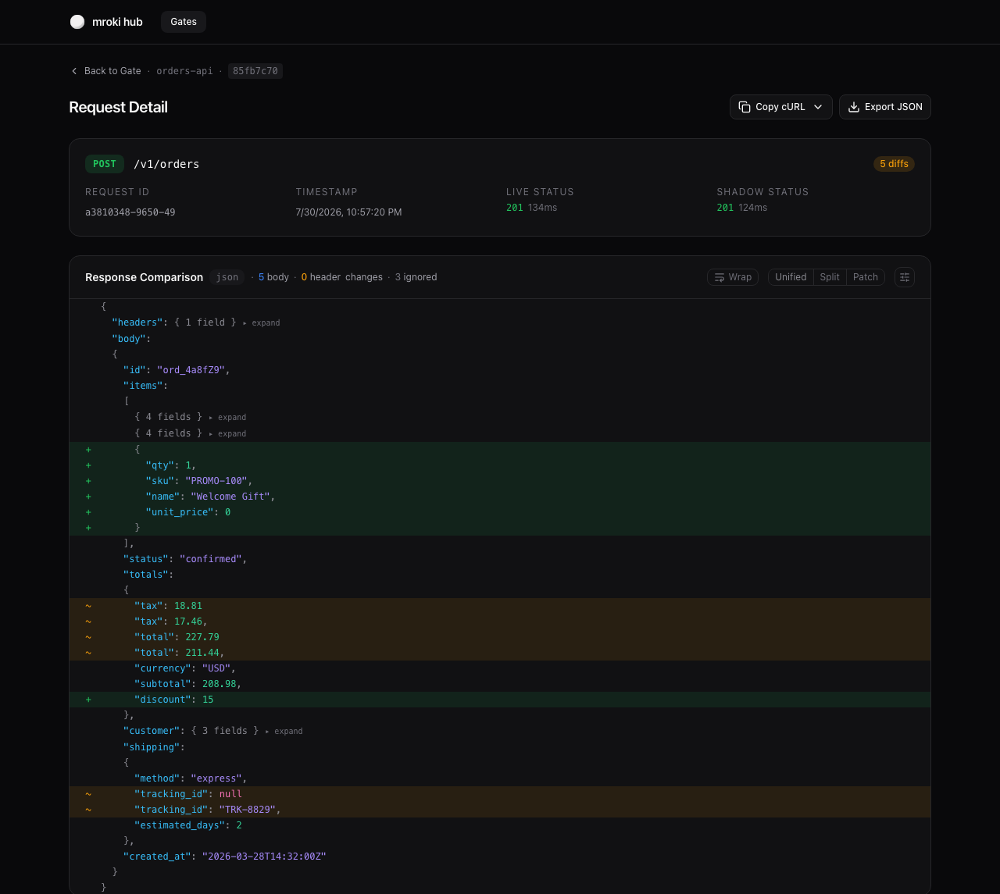
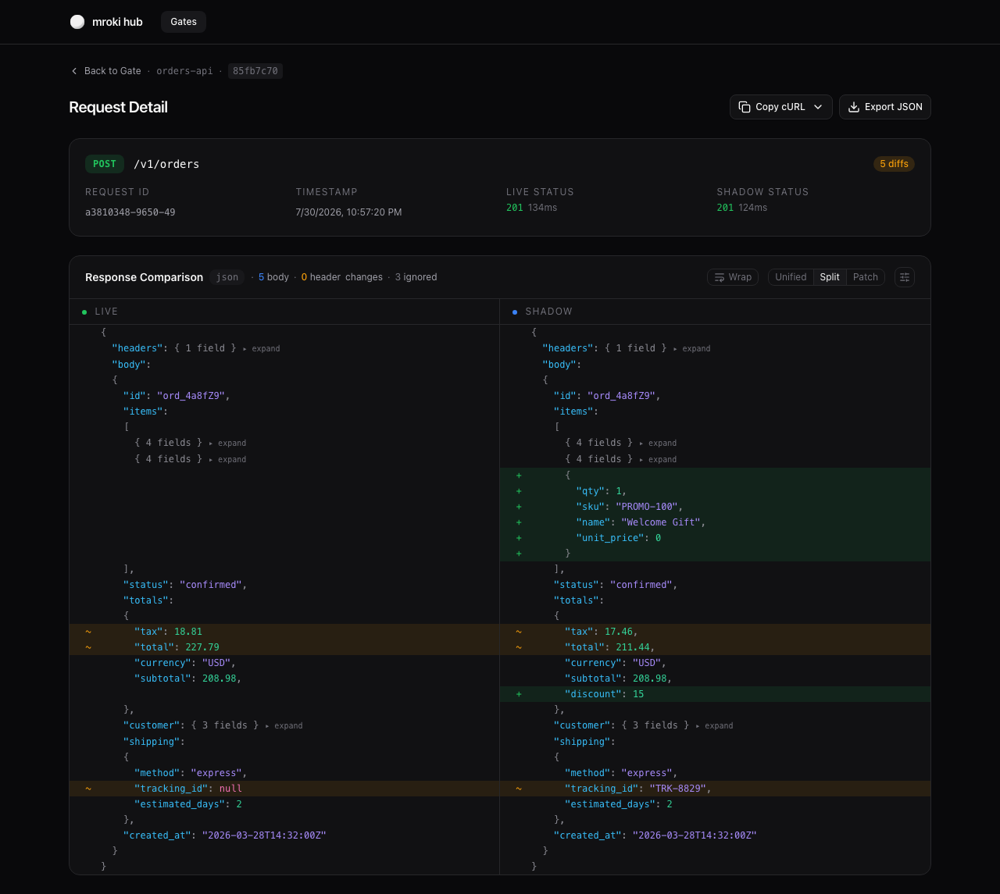
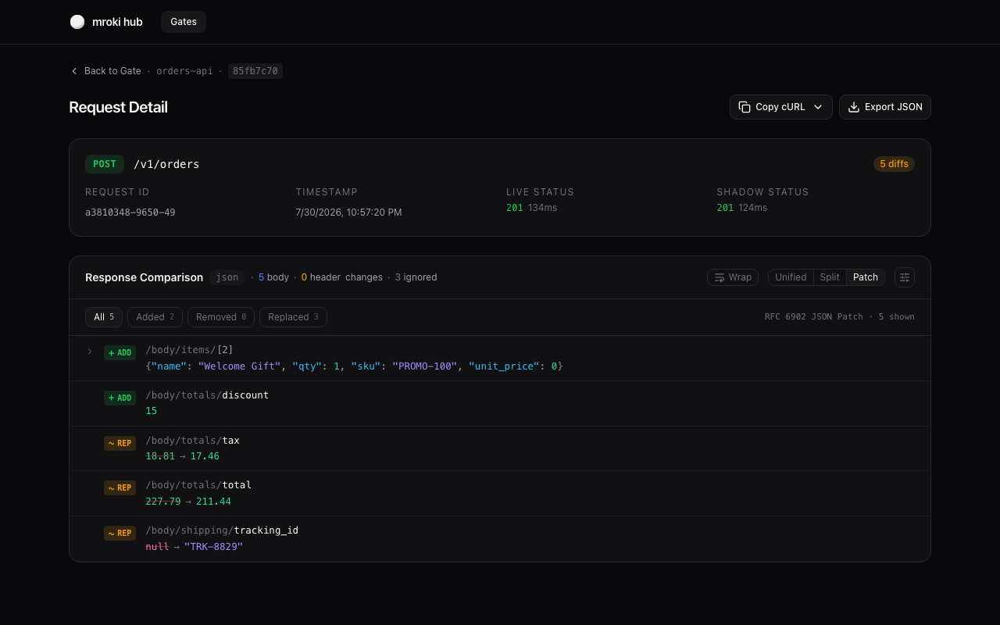

# Screenshots

A visual tour of the mroki Hub interface.

## Gates

Manage your live/shadow service pairs. Each gate card shows the live and shadow URLs, request volume, diff rate, and proxy status.

## Create Gate

Create a new gate by entering a name and the live/shadow service URLs. The dialog validates inputs before submission.

## Gate Detail

Browse captured requests for a gate. Filter by HTTP method or path, toggle "Has diff only" to focus on requests that produced diffs, and sort the list — each row shows the live/shadow status, latency, and diff state.

## Gate Settings

Configure security, retention, and diff behavior per gate. Field redaction replaces sensitive values with `[REDACTED]` before storage — default fields are always active, and you can add per-gate fields using gjson path notation. Data retention sets how long captured requests are kept before cleanup, overriding the global default (a per-gate value must be at least the global retention). Diff configuration controls ignored fields, included fields, float tolerance for numeric comparisons, and array sorting.

## Request Detail — Unified Diff

Visualize JSON response diffs with syntax-highlighted tokens. Unchanged subtrees are collapsed by default — click any collapsed node to expand it inline.

## Request Detail — Split Diff

Side-by-side comparison of live and shadow responses with matched rows.

## Request Detail — Patch List

Flat list of the RFC 6902 JSON Patch operations that make up the diff, filterable by operation type (added, removed, replaced). Complex or long values expand inline for full detail.

