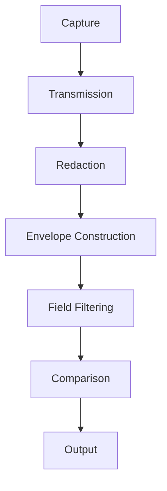
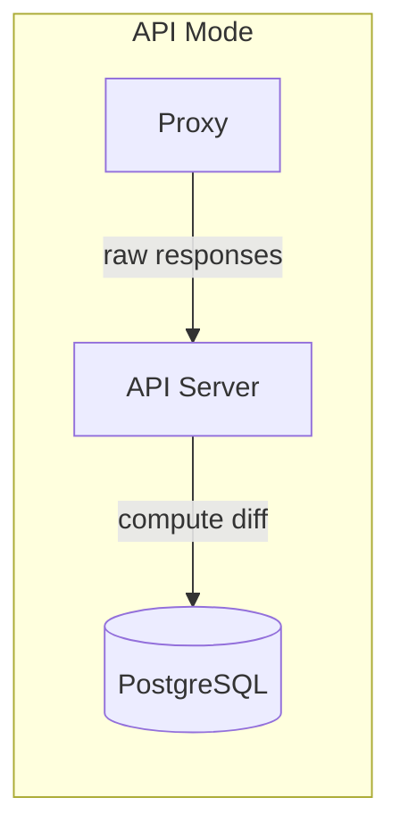
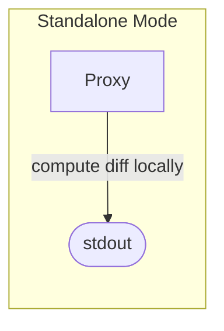

# Diff Pipeline

The diff engine is the core of mroki's shadow traffic testing. It compares the HTTP response from your **live** service against the response from your **shadow** service and produces a structured list of differences. This lets you answer: *"For this request, how did the shadow's response differ from live?"*

## Pipeline Overview

Every diff goes through the same stages, regardless of operating mode:



### Stages

1. **Capture** — The proxy intercepts an HTTP request, forwards it to both the live and shadow services in parallel, and returns the live response to the client immediately. Both responses are captured for comparison.

2. **Transmission** — In **API mode**, the proxy sends raw responses (with base64-encoded bodies) to the API server via HTTP POST, with automatic retry and circuit breaker. In **standalone mode**, this step is skipped — everything happens locally in the proxy.

3. **Redaction** — Sensitive fields are replaced with `[REDACTED]` before any comparison takes place. A default set of fields is always redacted (e.g., `Authorization` and `Cookie` headers, common credential body paths). Additional fields can be configured per gate.

4. **Envelope Construction** — Both responses are wrapped into synthetic JSON documents with this structure:
   ```json
   { "statusCode": 200, "headers": { "...": "..." }, "body": { "...": "..." } }
   ```
   This ensures the **full response** is compared — status code and headers included — not just the body.

5. **Field Filtering** — Optional include/exclude lists narrow the comparison scope:
   - **Include list** (whitelist): only the specified fields are compared.
   - **Exclude list** (blacklist): the specified fields are removed before comparison.
   - If both are set, include is applied first, then exclude.
   - Field paths support array wildcards via gjson syntax (e.g., `users.#.email`).
   - The `X-Mroki-Mode` header that tags shadow requests is automatically excluded, so services that echo request headers back in their responses don't produce spurious diffs.

6. **Comparison** — The two documents are compared to produce a list of differences as RFC 6902 JSON Patch operations (`add`, `remove`, `replace`). Float values are compared with a configurable tolerance to avoid false positives from floating-point precision.

7. **Output** — In **API mode**, the diff is persisted to PostgreSQL alongside the request and both responses. In **standalone mode**, diffs are printed to stdout.

## Operating Modes

| | API Mode | Standalone Mode |
|---|---|---|
| **Diff computed by** | API server | Proxy (locally) |
| **Output destination** | PostgreSQL | stdout |
| **Requires mroki-api** | Yes | No |





## Output Format

Diffs use the **RFC 6902 JSON Patch** format. Each operation describes a single difference:

| Field | Description |
|---|---|
| `op` | Operation type: `add`, `remove`, or `replace` |
| `path` | Location of the change as an RFC 6901 JSON Pointer |
| `value` | New value (present for `add` and `replace`) |

The patch is **minimal by design** and carries no previous (`old`) value: a `replace`/`remove`
only records where the change is and what the new value is. The hub reconstructs the old value
client-side by resolving the path against the captured live response, so the stored diff stays a
standard, lossless RFC 6902 document.

**Example** — the shadow returned a different status code and a changed field in the body:

```json
[
  { "op": "replace", "path": "/statusCode", "value": 500 },
  { "op": "replace", "path": "/body/user/name", "value": "Bob" },
  { "op": "add", "path": "/body/user/role", "value": "admin" }
]
```

An empty array `[]` means the responses were identical (after redaction and filtering).

## Configuration

Diff behavior can be configured globally via environment variables or per gate in the gate configuration.

| Setting | Environment Variable | Per-Gate Field | Description |
|---|---|---|---|
| Excluded fields | `MROKI_APP_DIFF_IGNORED_FIELDS` | `diff_config.ignored_fields` | Fields to exclude from comparison (blacklist) |
| Included fields | `MROKI_APP_DIFF_INCLUDED_FIELDS` | `diff_config.included_fields` | Fields to include in comparison (whitelist) |
| Float tolerance | `MROKI_APP_DIFF_FLOAT_TOLERANCE` | `diff_config.float_tolerance` | Tolerance for floating-point comparisons |
| Sort arrays | `MROKI_APP_DIFF_SORT_ARRAYS` | `diff_config.sort_arrays` | Sort arrays before comparison so element order is ignored (`false` = positional comparison) |
| Redacted fields | `MROKI_APP_REDACTED_FIELDS` | `redacted_fields` | Fields replaced with `[REDACTED]` before comparison |

Field paths use **gjson syntax** — use `#` as an array wildcard (e.g., `users.#.email` matches the `email` field in every element of the `users` array).

### Array ordering

By default (`sort_arrays = false`) arrays are compared **positionally**, so reordering elements is a real difference: a moved element is reported as a `remove` at its old position paired with an `add` at its new position (RFC 6902 has no dedicated `move` for this engine). This is expected behavior, not a bug — an order-only change between two otherwise-identical arrays will surface as add/remove pairs in the Split, Unified, and Patch views alike. Presenting such pairs as a single "moved" affordance in the hub (without changing the stored diff) is tracked as a follow-up in [issue #120](https://github.com/pedrobarco/mroki/issues/120).

Set `sort_arrays = true` to sort arrays before diffing; element order is then ignored and reorders produce no diff (only genuine value changes remain).

Per-gate configuration overrides global defaults. See the [Configuration reference](../production/CONFIGURATION.md) for the full list of environment variables.
