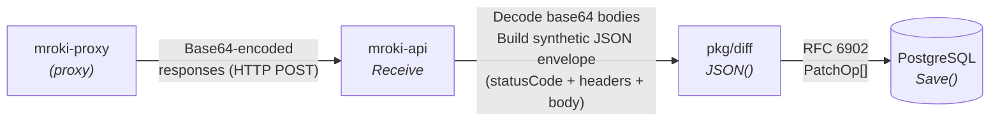
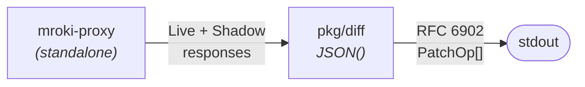

# Diff Entity Analysis

Analysis of the domain and persistence layers for the "diff" entity in mroki-hub.

## 1. Semantic Role

A **diff** in mroki-hub is a **delta-based comparison record** used for **shadow traffic testing**. It captures the computed difference between two HTTP responses: one from the **live** production service and one from the **shadow** (canary/candidate) service.

The system operates as a traffic mirroring platform: `mroki-proxy` proxies incoming requests to both live and shadow backends and sends the raw responses to `mroki-api`. The API computes a JSON diff of the two responses server-side and persists the entire capture (request + both responses + diff) for retrospective analysis in the `mroki-hub` dashboard. In standalone mode (no API), the proxy computes and prints diffs locally.

The diff is **not** used for state versioning or audit logging. It serves a purely **observational/analytical** function — answering the question: *"For this request, how did the shadow's response differ from the live's response?"*

## 2. Persistence Layer Data Model

The schema is defined via the **ent** ORM framework in `ent/schema/diff.go`.

**Table: `diffs`**

| Column | Type | Constraints |
|---|---|---|
| `id` | UUID | PK, immutable, auto-generated |
| `request_id` | UUID | Unique, FK → `requests.id` |
| `from_response_id` | UUID | Not null (no FK constraint) |
| `to_response_id` | UUID | Not null (no FK constraint) |
| `content` | JSON ([]diff.PatchOp) | Not null |
| `created_at` | TIMESTAMP | Not null, auto-generated |

**Key observations:**

- **1:1 relationship with Request**: Enforced by the `Unique()` constraint on `request_id` and the ent edge definition. Each request has at most one diff.
- **No formal FK on response IDs**: `from_response_id` and `to_response_id` reference the `responses` table by UUID, but are **not** declared as ent edges — they are plain UUID fields. No referential integrity enforcement or cascade behavior at the database level.
- **Content is structured RFC 6902 JSON Patch**: The diff content is stored as a JSON array of `diff.PatchOp` objects, each containing `op`, `path`, and `value` fields following the RFC 6902 JSON Patch standard. This format is machine-parseable, queryable, and interoperable.

## 3. Domain Model Representation

The domain model lives at `internal/domain/traffictesting/diff.go`.

**Mapping analysis** (via `mapDiffToDomain` in `internal/infrastructure/persistence/ent/mapper.go`):

- **The domain model is a Value Object** — it has no identity (`ID` is not carried into the domain) and carries `FromResponseID`, `ToResponseID`, `Content` (as `[]diff.PatchOp`), and `CreatedAt`. It provides `IsZero()` and `Equals()` methods. The `NewDiff()` constructor accepts typed `[]diff.PatchOp` content.
- **The mapping is trivially thin** — a near 1:1 projection with no transformation, which is efficient but reveals the domain model adds very little encapsulation over the persistence model.
- **Diff is embedded in Request as a field, not a separate aggregate** — this correctly models the lifecycle dependency (a diff cannot exist without a request).
- **The `ID` field is dropped during domain mapping** — the persistence entity has an `id` column, but the domain `Diff` struct has no `ID` field. The diff is always accessed through its parent request.

## 4. Diff Workflow

### Full lifecycle



**Standalone mode** (no API): the proxy computes diffs locally using the same `pkg/diff` engine and prints to stdout.



**Step-by-step:**

1. **Capture** (proxy-side, `pkg/proxy/proxy.go`): After both live and shadow responses return, the proxy invokes the callback with the raw `ProxyRequest`, live `ProxyResponse`, and shadow `ProxyResponse`. No diff computation occurs in the proxy.
2. **Transmission** (proxy → API, `pkg/client/converter.go`): The raw responses (base64-encoded bodies) are sent as part of `CreateRequestPayload` via HTTP POST. The `diff` field is omitted from the payload.
3. **Diff computation** (API-side, `internal/application/commands/create_request.go`): When the `diff` field is absent, `computeDiff()` decodes the base64 response bodies, constructs synthetic JSON documents (statusCode + headers + body), and calls `diff.JSON()` to produce RFC 6902 patch operations. If the proxy provides a pre-computed diff (backward compatibility), it is used as-is.
4. **Persistence** (API-side, `internal/infrastructure/persistence/ent/request_repository.go`): The entire request+responses+diff is saved in a single database transaction. `saveDiff()` checks `IsZero()` and skips if no diff exists.
5. **Retrieval** (API-side): Diffs are always eager-loaded with their parent request via `WithDiff()`. A `has_diff` filter exists in `RequestFilters`.

### Potential bottlenecks

| Issue | Impact | Severity |
|---|---|---|
| Content stored as unbounded TEXT | Large JSON responses produce large diff strings; no size limit | Medium |
| Non-standard, non-queryable diff format | Cannot filter/aggregate by changed fields at the DB level | Medium |
| Body embedded in synthetic JSON | Diff wraps full response body into a JSON envelope, inflating content | Medium |
| Server-side diff computation at ingest | Diff computed synchronously during `CreateRequest` — blocks write path | Medium |
| No indexing on response ID columns | Future joins/lookups by response ID would table-scan | Low |


## 5. Recommendations

### 5.1 Improve Relational Integrity (High Priority)

`from_response_id` and `to_response_id` are plain UUID fields with no ent edges — no FK constraints, no cascade deletes, and no eager-loading. Define proper ent edges from `Diff` to `Response` to add FK constraints, enable eager-loading, and ensure cascade behavior.

### ~~5.2 Adopt a Structured, Standard Diff Format~~ ✅ Completed

Diffs are now stored in **RFC 6902 JSON Patch** format as `[]diff.PatchOp`:

```json
[
  {"op": "replace", "path": "/statusCode", "value": 500},
  {"op": "replace", "path": "/body/user/name", "value": "Bob"}
]
```

This format is queryable with PostgreSQL JSONB, machine-parseable, and interoperable.

### 5.3 Enrich the Domain Model (Medium Priority)

The domain `Diff` is an anemic value object with no validation and a constructor that never fails. Add semantic richness with a structured `DiffOp` type and domain behavior methods like `HasChanges()`, `ChangedPaths()`, `HasStatusCodeChange()`, and `Summary()`.

### 5.4 Bound and Optimize Content Storage (Medium Priority)

No size limit on diff content; large response bodies produce large diff strings in unbounded TEXT.

- Truncate or cap diff content at a configurable maximum (e.g., 64KB) with a `truncated` boolean flag.
- Add a `change_count` integer column for lightweight filtering/aggregation without parsing the content blob.
- Consider compression (zstd/gzip) for large diffs before storage.

### ~~5.5 Add `created_at` Timestamp to Diff~~ ✅ Completed

The `Diff` domain model now includes a `CreatedAt` field, set automatically during construction via `NewDiff()`.

### 5.6 Consider Async Diff Computation (Low Priority)

Diff computation now happens server-side in mroki-api during request ingest (synchronous). The proxy sends raw captures without a diff, and the API computes the diff before persisting. For even higher throughput, a future enhancement could move diff computation to an async worker pool: the API would store raw responses immediately and enqueue diff jobs for background processing. This would decouple ingest latency from diff complexity.

## Summary

| Area | Current State | Recommendation | Priority |
|---|---|---|---|
| Referential integrity | `from/to_response_id` are plain UUIDs | Add ent edges with FK constraints | High |
| Content format | ~~Proprietary text via `cleanReporter`~~ RFC 6902 JSON Patch (`[]diff.PatchOp`) | ✅ Completed | — |
| Domain model | Anemic value object, no validation | Structured `DiffOp` list, domain behavior | Medium |
| Storage bounds | Unbounded TEXT, no size limit | Cap content size, add `change_count` column | Medium |
| Temporal metadata | ~~No timestamp on diff~~ `CreatedAt` field present | ✅ Completed | — |
| Computation architecture | Synchronous server-side (API) | Consider async worker pipeline at scale | Low |