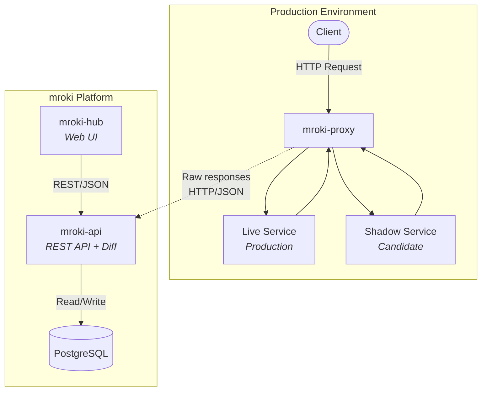
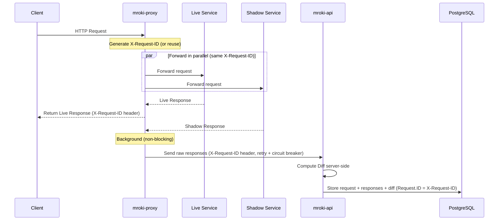

# Architecture Overview

This document provides a high-level overview of mroki's architecture, component interactions, and key design principles.

## System Architecture

mroki consists of four main components:



## Components

### 1. mroki-proxy (Go)

**Purpose:** Transparent HTTP proxy that mirrors traffic to shadow services

**Responsibilities:**
- Intercept incoming HTTP requests
- Operate in dual modes: fetch gate config from API or use hardcoded URLs
- Forward to both live and shadow services in parallel
- Return live service response to client immediately
- Send raw captured responses to mroki-api with retry logic (API mode)
- Compute and print JSON diffs locally (standalone mode only)

**Technology:**
- Language: Go 1.26+
- HTTP Proxy: Custom `pkg/proxy`
- Diff Engine: Custom JSON differ `pkg/diff` (gjson/sjson + go-cmp) — used only in standalone mode
- API Client: `pkg/client` with exponential backoff

**Deployment:** Runs as a sidecar proxy or standalone service in production environment

---

### 2. mroki-api (Go)

**Purpose:** REST API for managing gates, computing diffs, and persisting traffic data

**Responsibilities:**
- Gate CRUD operations (create, read, update, delete, list)
- Receive raw captured requests and responses from proxies
- Compute JSON diffs server-side (when not provided by proxy)
- Persist requests, responses, and computed diffs
- Serve request/response data to hub
- Health check endpoints for Kubernetes

**Technology:**
- Language: Go 1.26+
- Framework: net/http (stdlib, Go 1.22+ routing)
- Database: PostgreSQL with pgx/v5
- ORM: Ent (schema-first, type-safe)

**Deployment:** Stateless service, horizontally scalable

---

### 3. mroki-hub (Vue.js)

**Purpose:** Web interface for visualizing diffs and managing the system

**Responsibilities:**
- Display gate dashboard
- Browse captured requests
- Visualize response diffs with syntax highlighting
- Manage gate configuration

**Technology:**
- Framework: Vue 3 + TypeScript + Composition API + `<script setup>`
- Build Tool: Vite
- HTTP Client: Native `fetch()`
- Diff Visualization: Custom JSON diff renderer (RFC 6902 patch operations)
- Styling: TailwindCSS v4

**Deployment:** Static SPA served via CDN or web server

---

### 4. caddy-mroki (Go)

**Purpose:** Caddy server module for standalone shadow traffic diffing

**Responsibilities:**
- Integrate mroki proxy into Caddy HTTP server
- Provide Caddyfile configuration syntax for proxy, sampling, body size, and diff options
- Compute JSON diffs locally and print results (standalone mode only — no API integration)
- Enable mroki without a separate proxy binary

**Technology:**
- Language: Go 1.26+
- Integration: Caddy module system

**Deployment:** Compiled into Caddy binary

---

## Data Flow

### Request Capture Flow



### Key Properties

- **Non-blocking:** Live response returns immediately, shadow processing happens in background
- **Best-effort:** API failures are logged but don't affect live traffic
- **Idempotent:** Retries are safe (requests have unique IDs)
- **Server-side diffing:** Diff computation happens in mroki-api, keeping the proxy lightweight
- **JSON-only:** Only JSON responses are diffed

---

## Data Model

### Core Entities

```
┌──────────┐
│  gates   │
└────┬─────┘
     │ 1:N
     ↓
┌──────────┐
│ requests │
└────┬─────┘
     │ 1:N
     ↓
┌───────────┐     ┌────────┐
│ responses │────▶│ diffs  │
└───────────┘ N:1 └────────┘
```

The database stores four main entities: **Gates** (live/shadow service pairs), **Requests** (captured HTTP requests), **Responses** (HTTP responses from live and shadow services), and **Diffs** (computed differences between response pairs).

```go
// Gate represents a live/shadow service pair (command-side aggregate)
type Gate struct {
    ID          GateID      // UUID
    Name        GateName    // Unique, mutable name
    LiveURL     GateURL     // Production service URL (immutable)
    ShadowURL   GateURL     // Shadow service URL (immutable)
    DiffConfig  DiffConfig  // Per-gate diff computation settings
    RedactedFields RedactedFields // Per-gate field redaction (additional fields on top of defaults)
    CreatedAt   time.Time
}

// GateStats is a read-side projection (not part of Gate aggregate)
// Fetched via StatsRepository.GetStatsByGateIDs and composed in query handlers

// Request represents a captured HTTP request
type Request struct {
    ID         RequestID  // UUID
    GateID     GateID     // Parent gate
    Method     string     // HTTP method (GET, POST, etc.)
    Path       string     // Request path
    Headers    Headers    // HTTP headers
    Body       []byte     // Request body
    CreatedAt  time.Time
}

// Response represents a service response
type Response struct {
    ID          ResponseID  // UUID
    RequestID   RequestID   // Parent request
    StatusCode  int         // HTTP status code
    Headers     Headers     // Response headers
    Body        []byte      // Response body
    Duration    Duration    // Response time
    IsLive      bool        // true=live, false=shadow
}

// Diff represents computed difference between live and shadow responses
type Diff struct {
    FromResponseID uuid.UUID      // Live response ID
    ToResponseID   uuid.UUID      // Shadow response ID
    Content        []diff.PatchOp // RFC 6902 JSON Patch operations
    CreatedAt      time.Time
}
```

### Relationships

All relationships use `ON DELETE CASCADE` — deleting a gate cascades to all its requests, responses, and diffs.

- **Gate → Requests:** 1:N (one gate has many requests)
- **Request → Responses:** 1:2 (one live, one shadow)
- **Request → Diff:** 1:1 (one diff per request)

### Storage

- **Headers** are stored as JSONB (indexable, supports multiple values per key)
- **Bodies** are stored as BYTEA (handles any content type)
- **Diff content** is stored as TEXT (RFC 6902 JSON Patch, human-readable)

### Schema Management

- Schema defined in `ent/schema/`
- Migrations generated via `make api-migrate name=<description>`
- Auto-applied on API startup via ent auto-migration

---

## Key Design Decisions

### 1. Server-Side Diffing

**Decision:** Compute diffs in mroki-api, not the proxy

**Rationale:**
- Proxy stays lightweight — a thin HTTP forwarder with minimal CPU usage
- Centralized diff logic — one place to change algorithms, options, or filters
- Enables re-diffing with different config without replaying traffic
- Scales independently from traffic proxying
- In standalone mode (no API), the proxy still computes diffs locally as a fallback

### 2. Best-Effort Delivery

**Decision:** Proxy never fails live traffic due to API issues

**Rationale:**
- Shadow testing should never impact production
- API outages shouldn't affect live service
- Failed captures can be logged and monitored
- Trade-off: Some diffs may be lost

### 3. JSON-Only Diffing

**Decision:** Only diff JSON responses, skip others

**Rationale:**
- JSON is structured and diffable
- Binary/HTML diffs less meaningful
- Reduces storage and processing costs
- Future: Can add support for other types

### 4. Resilient HTTP Client (Retry + Circuit Breaker)

**Decision:** API requests use a composable `http.RoundTripper` stack (via failsafe-go) with exponential backoff retry and circuit breaker. Auth and logging are also handled as RoundTrippers.

**Rationale:**
- Handle temporary API unavailability with automatic retries
- Circuit breaker stops all requests when API is persistently down, avoiding wasted resources
- Composable transport layers keep `MrokiClient` simple (no retry/auth/logging awareness)
- Context-based timeout controls the overall deadline for all retries combined

### 5. Stateless API

**Decision:** API is fully stateless, all state in PostgreSQL

**Rationale:**
- Horizontal scalability
- Simple deployment model
- No session management needed
- Easy to load balance

### 6. Dual Operating Modes

**Decision:** Proxy works in API mode (fetches config) or standalone mode (hardcoded URLs)

**Rationale:**
- API mode: Centralized configuration management
- Standalone mode: Useful for local testing and validation
- Graceful degradation when API unavailable
- Reduces operational dependencies for simple setups
- Proxy can operate without API connection

---

> **Security, monitoring, and deployment details** have moved to dedicated guides:
> - [Security](../production/SECURITY.md) — authentication, redaction, TLS, hardening
> - [Monitoring](../production/MONITORING.md) — logging, health checks, observability
> - [Docker Compose](../production/DOCKER_COMPOSE.md) / [Kubernetes](../production/KUBERNETES.md) — deployment topologies

---

## Technology Choices

### Why Go?

- Excellent HTTP/network performance
- Strong standard library (net/http)
- Easy concurrency (goroutines for parallel requests)
- Single binary deployment
- Great testing support

### Why Vue 3?

- Reactive and performant
- Excellent TypeScript support
- Composition API for reusable logic
- Strong ecosystem (Vite, TailwindCSS, etc.)
- Smaller bundle size than React

### Why PostgreSQL?

- JSONB support for flexible diff storage
- Strong consistency guarantees
- Excellent query performance
- Mature tooling and operations
- Native UUID support

### Why sqlc?

- Type-safe SQL queries
- Compile-time validation
- No reflection overhead
- Direct SQL control
- Simple integration with pgx

---

## Future Enhancements

### Phase 2 (Completed)
- [x] Proxy fetches gate configuration from API
- [x] Dual operating modes (API vs standalone)
- [x] Configurable diff options (field filtering via normalizer, go-cmp based diffing)
- [x] API key authentication
- [x] Rate limiting (token bucket, configurable per IP)
- [x] CORS support (`rs/cors`)
- [x] TTL cleanup job for expired requests

### Phase 3
- [ ] Sampling configuration per gate
- [ ] Batch API requests for efficiency
- [ ] Prometheus metrics
- [ ] Request replay (send to shadow on-demand)
- [ ] Diff analysis algorithms (similarity scores)

### Phase 4
- [ ] Alerting on unexpected diffs
- [ ] Multi-region support
- [ ] Performance regression detection
- [ ] Advanced diff visualization

---

## Related Documentation

- [API Reference](../api/REFERENCE.md) — Full endpoint specification
- [API Walkthrough](../api/WALKTHROUGH.md) — Step-by-step tutorial
- [Configuration](../production/CONFIGURATION.md) — All environment variables
- [Troubleshooting](../TROUBLESHOOTING.md) — Common issues and fixes

