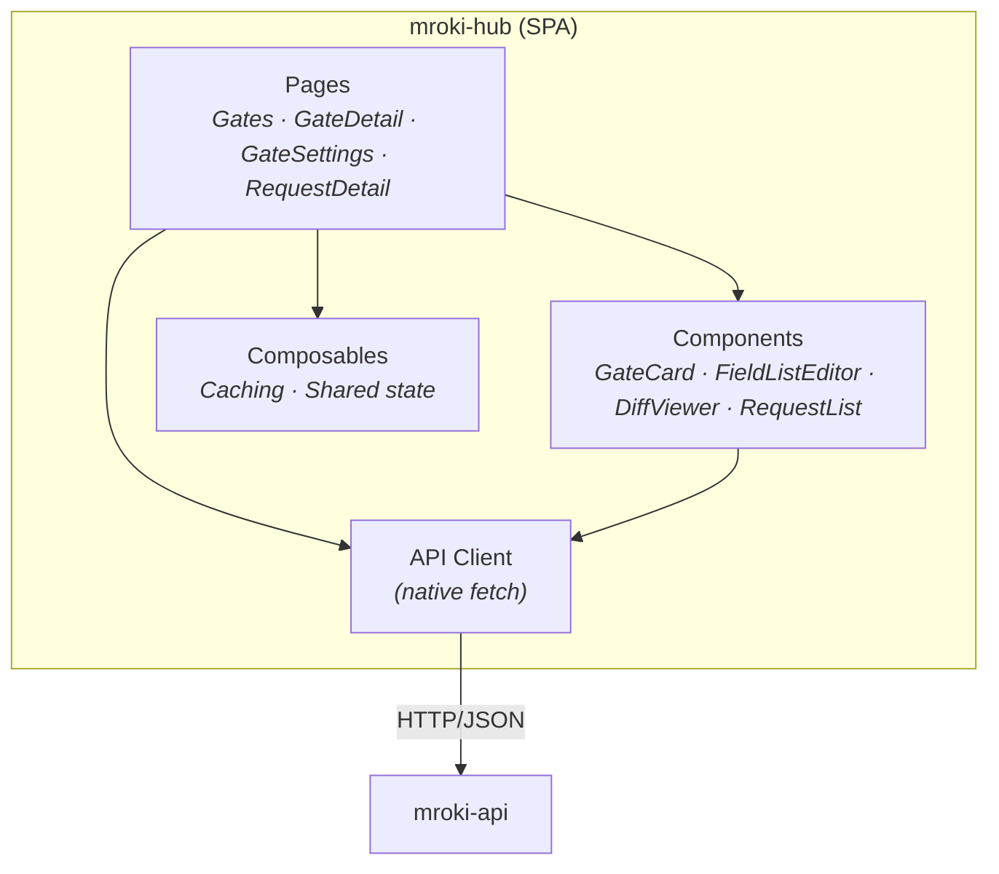

# mroki-hub

**Web interface for visualizing diffs and managing gates**

mroki-hub is a Vue 3 single-page application that provides a user-friendly interface for managing gates, browsing captured traffic, and visualizing response diffs.

## Features

- **Gate Management:** Create, configure, and delete gates. List and filter all gates with pagination and sorting.
- **Gate Settings Page:** Dedicated settings page for each gate — update name, configure header scrubbing (default + per-gate additional fields), diff configuration (ignored/included fields, float tolerance), and delete gate.
- **Request Browser:** List captured requests for a gate with filters (method, path, has_diff), sorting, and pagination. "Showing N of M requests" label.
- **Diff Visualization:** View response diffs with side-by-side and unified views
- **JSON Diff Engine:** Custom client-side diff renderer from RFC 6902 patch operations
- **Copy cURL:** Dropdown with Live/Shadow options, generates full cURL command with headers and body
- **Export JSON:** Downloads full request detail as `request-{id}.json`
- **Dashboard Stats:** Global stats bar (total gates, requests 24h, diff rate) via `GET /stats`

## Technology Stack

- **Framework:** Vue 3 with Composition API + `<script setup>`
- **Language:** TypeScript (required in all Vue components via ESLint)
- **Build Tool:** Vite
- **Routing:** Vue Router with `createWebHistory`
- **HTTP Client:** Native `fetch()` (no Axios, no Pinia)
- **Diff Engine:** Custom JSON diff renderer (RFC 6902 patch operations)
- **Styling:** Tailwind CSS v4 with CSS variables theming
- **UI Components:** shadcn-vue
- **Testing:** Vitest + Vue Test Utils
- **Code Quality:** ESLint + Prettier with pre-commit hooks

## Architecture



## Project Structure

```
web/mroki-hub/
├── public/                        # Static assets
├── e2e/                           # Playwright E2E tests
├── src/
│   ├── api/                       # API client (native fetch)
│   ├── components/
│   │   ├── diff/                  # JSON diff visualization
│   │   ├── gates/                 # Gate management components
│   │   ├── layout/                # App shell (Header)
│   │   ├── requests/              # Request browser components
│   │   └── ui/                    # shadcn-vue primitives
│   ├── composables/               # Vue composables (caching)
│   ├── lib/                       # Utilities and JSON diff engine
│   ├── pages/                     # Route-level views
│   ├── router/                    # Vue Router config
│   ├── App.vue
│   ├── main.ts
│   └── style.css                  # TailwindCSS v4 + theme variables
├── index.html
├── package.json
├── vite.config.ts
├── vitest.config.ts
├── playwright.config.ts
└── eslint.config.js
```

## Routes

```
/gates                      # Gate list + create gate form
/gates/:id                  # Gate detail (requests for gate)
/gates/:id/settings         # Gate settings (name, scrub config, diff config, delete)
/gates/:id/requests/:rid    # Request detail (full diff view)
```

## API Integration

The hub communicates with mroki-api via REST. All requests include an API key via the `Authorization: Bearer <key>` header.

**Response format:**
- Success: `{ "data": ... }`
- Paginated: `{ "data": [...], "pagination": { "limit": 20, "offset": 0, "total": 100, "has_more": true } }`
- Errors: RFC 7807 (`{ "type": "/errors/...", "title": "...", "status": 400, "detail": "..." }`)

```typescript
// Example API client usage

// Get all gates
const response = await fetch(`${API_BASE}/gates`, {
  headers: { "Authorization": `Bearer ${apiKey}` },
});
const { data } = await response.json();

// Create gate
const response = await fetch(`${API_BASE}/gates`, {
  method: "POST",
  headers: {
    "Content-Type": "application/json",
    "Authorization": `Bearer ${apiKey}`,
  },
  body: JSON.stringify({
    name: "checkout-api",
    live_url: "https://api.production.example.com",
    shadow_url: "https://api.shadow.example.com",
  }),
});

// Get requests for gate (paginated)
const response = await fetch(
  `${API_BASE}/gates/${gateId}/requests?limit=20&offset=0`,
  { headers: { "Authorization": `Bearer ${apiKey}` } },
);
const { data, pagination } = await response.json();
```

## Configuration

Environment variables (via `.env`):

```bash
# API base URL (required)
VITE_API_BASE_URL=http://localhost:8090

# API key for authentication
VITE_API_KEY=your-api-key
```

CORS must be configured on mroki-api to allow requests from the hub dev server:

```bash
# In mroki-api .env
MROKI_APP_CORS_ORIGINS=http://localhost:5173
```

## Development Setup

### Prerequisites
- Node.js 18+
- pnpm (required for mroki-hub)
- mroki-api running on port 8090

### Installation

```bash
cd web/mroki-hub

# Install dependencies
pnpm install

# Create .env file
cat > .env << 'EOF'
VITE_API_BASE_URL=http://localhost:8090
VITE_API_KEY=your-api-key
EOF

# Start dev server
pnpm dev
```

### Build

```bash
# Production build
pnpm build

# Preview production build
pnpm preview

# Lint code
pnpm lint

# Format code
pnpm format
```

### Coding Conventions

#### TypeScript Requirement

**All Vue components MUST use TypeScript.** This is enforced by ESLint.

```vue
<!-- ✅ Correct: TypeScript with lang="ts" -->
<script setup lang="ts">
import { ref } from 'vue'

const count = ref<number>(0)
</script>

<!-- ❌ Incorrect: Plain JavaScript (ESLint error) -->
<script setup>
const count = ref(0)
// Error: The 'lang' attribute of '<script>' is missing
</script>
```

#### Theming

mroki-hub uses **CSS variables** for theming following [shadcn-vue conventions](https://www.shadcn-vue.com/docs/theming.html).

**Always use semantic color tokens:**

```vue
<!-- ✅ Correct: CSS variables -->
<div class="bg-background text-foreground">
  <button class="bg-primary text-primary-foreground">Action</button>
  <p class="text-muted-foreground">Secondary text</p>
</div>

<!-- ❌ Incorrect: Hardcoded colors -->
<div class="bg-white text-gray-900">
  <button class="bg-blue-600 text-white">Action</button>
  <p class="text-gray-500">Secondary text</p>
</div>
```

**Available color tokens:**
- `background` / `foreground` - Main colors
- `primary` / `primary-foreground` - Primary actions
- `muted` / `muted-foreground` - Secondary content
- `card` / `card-foreground` - Cards
- `destructive` / `destructive-foreground` - Destructive actions
- `border`, `input`, `ring` - Borders and focus

See `web/mroki-hub/README.md` for complete documentation.

## Deployment

### Static Hosting

The hub is a static SPA that can be hosted anywhere:

```bash
# Build
npm run build

# Deploy dist/ to:
# - Netlify
# - Vercel
# - AWS S3 + CloudFront
# - Any static file server
```

### Docker

```dockerfile
FROM node:18-alpine AS builder
WORKDIR /app
COPY package*.json ./
RUN npm ci
COPY . .
RUN npm run build

FROM nginx:alpine
COPY --from=builder /app/dist /usr/share/nginx/html
COPY nginx.conf /etc/nginx/nginx.conf
EXPOSE 80
CMD ["nginx", "-g", "daemon off;"]
```

## Implementation Phases

1. ✅ **Scaffold** — Vite + Vue 3 + TypeScript + Tailwind CSS v4 + Vue Router
2. ✅ **Theming** — CSS variables with shadcn-vue conventions, dark mode support
3. ✅ **Code Quality** — ESLint + Prettier + pre-commit hooks
4. ✅ **API client + types** — Native fetch wrapper, TypeScript types matching API contracts
5. ✅ **Gate page** — List gates, create gate form, filtering
6. ✅ **Request browser** — List requests with filters, sorting, pagination
7. ✅ **Diff viewer** — Request detail page with custom JSON diff visualization
8. ✅ **E2E tests** — Playwright tests for gates, requests, navigation
9. ✅ **Gate Settings** — Dedicated settings page with header scrubbing, diff config, and danger zone

## Related Documentation

- [Architecture Overview](../architecture/OVERVIEW.md)
- [API Contracts](../architecture/API_CONTRACTS.md) - Hub consumes these endpoints
- [mroki-api Component](MROKI_API.md) - Backend API
- [Quick Start Guide](../guides/QUICK_START.md)
